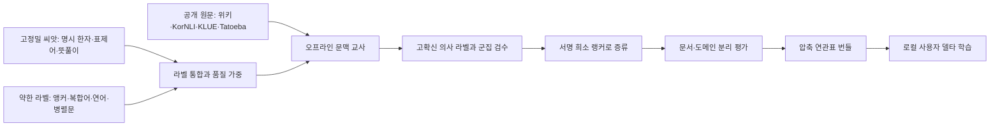

# 문맥 기반 한자 추천을 대규모로 개선하는 방법

작성일: 2026-07-20  
개정: 2026-07-24 — 실행 비용·측정 가능성·스택 제약(Kiwi 통사 미지원, 학생 모델 unseen 한계) 검토 반영, 상용 일본어 IME 수준을 위한 런타임 문맥 축(§9) 추가  
범위: 현재 연관표 생성·평가·런타임 구조의 진단과 차세대 학습 파이프라인 제안  
관련 문서: [실행 계획](plans/hanja-context-scaling-plan.md), [기존 단계별 계획](plans/context-aware-hanja-conversion.md), [5a 수집 보고](plans/hanja-context-5a-report.md), [5b 연관표 보고](plans/hanja-context-5b-report.md), [평가 기록](plans/hanja-context-eval-baseline.md)

## 결론

문장별로 연관표를 고치는 방식으로는 긴 꼬리(long tail), 도메인 이동, 고유어 동음이의어를 끝까지 따라갈 수 없다. 다음 세 가지를 한 묶음으로 바꾸는 것이 가장 큰 개선 경로다.

1. 위키의 명시적 한자 병기·표제어, 사전 뜻풀이, 비모호 복합어에서 **신청 없이 재현 가능한 고정밀 씨앗 라벨**을 만든다.
2. 이 씨앗으로 오프라인 문맥 교사를 학습해 위키 전체와 라이선스가 명확한 공개 한국어 문장에 의사 라벨을 붙이고, 사람은 불확실한 문장 군집의 대표만 검수한다.
3. 큰 한국어 문맥 모델은 **오프라인 교사 모델**로만 쓰고, 결과를 위치·절 근사 정보를 포함한 **서명 있는 희소 랭커**로 증류해 입력기에는 작은 테이블만 싣는다.

즉, 권장 구조는 `더 큰 수작업 연관표`가 아니라 **공개 씨앗 → 문맥 교사 → 공개 원문의 의사 라벨 → 군집 검수 → 희소 학생 → 자동 평가 → 경량 번들**이다. 다만 이 구조 전체가 확정 계획은 아니다. 교사 없이도 가능한 **0단계**(평가 특혜 제거, 문서·family cap, 읽기별 signed 양자화·이진 포맷)는 무조건 실행하고, 교사·의사 라벨 이후 단계는 §7.2의 수확량·정밀도 게이트를 통과할 때만 연다. 게이트 미달 시에는 혼동 상위 읽기를 curated override(`scripts/hanja-context/curated-association-overrides.txt`)로 채우는 기존 경로가 사용자 영향당 비용이 더 쌀 수 있으므로 그쪽으로 회귀한다. 오프라인 데이터 축과 별개로, 상용 일본어 IME 체감 품질의 핵심인 확정 문맥·세션 학습·결합 선택은 §9의 런타임 문맥 축으로 정의한다. 이 축은 새 말뭉치 없이 실행 가능하므로 0단계와 함께 가장 먼저 착수할 가치가 있다. 현재의 containment 규칙, 자동 변환 증거 게이트, 사용자 사전은 고정밀 안전장치로 보존한다. 국립국어원 2025 어휘 의미 분석 말뭉치는 공식 설명과 확인 가능한 기존 스키마에서 한자 정답 필드가 확인되지 않았고 신청·파생물 배포 조건도 불확실하므로, 핵심 경로가 아니라 실제 스키마와 조건이 확인될 때만 쓰는 선택 자원으로 내린다.



## 1. 현재 방식의 위치

### 1.1 이미 잘된 부분

현재 구현은 단순 빈도표보다 훨씬 앞서 있다.

- `hanja.txt` 후보와 디코딩된 단어 빈도를 기반으로 한 기본 순위가 있다.
- 같은 어절의 지배 한자 containment 신호가 고정밀 규칙으로 작동한다.
- 위키백과 병기, 비모호 복합어 앵커, NIKL 뜻풀이, 파생어 연어를 합친 연관표가 있다.
- Kiwi 런타임과 오프라인 수집기의 형태소 공간을 일치시켰다.
- 고유어 동음이의어 482개에는 문맥 증거가 없으면 한글을 유지하는 안전 게이트가 있다.
- 연관 점수 계산은 약 0.4ms로 기록되어 입력기 핫패스에 충분히 가볍다.

현재 번들 [hanja-context.txt](../woorilee/data/hanja/hanja-context.txt)는 실측상 다음 규모다.

| 항목 | 현재 값 |
| --- | ---: |
| 읽기 | 3,258 |
| 후보 프로필 | 18,119 |
| 피처 출현 | 531,990 |
| 텍스트 크기 | 8,070,881 bytes |
| 후보당 기본 상한 | 100 피처 |
| 평가 데이터 | 258문장, 31읽기 |

기록된 실제 Kiwi 평가에서 연관표를 켰을 때 v1은 126/187, v2는 53/55 top1까지 도달했다. 이는 현재 아이디어가 유효하다는 증거다. 다만 아래 이유 때문에 이 수치를 전체 어휘의 일반화 품질로 해석할 수는 없다.

### 1.2 지금 병목은 데이터와 평가다

현재 `build_association_table.py`는 본질적으로 후보별 형태소 공기 빈도를 고정 수식으로 합친 선형 모델이다. 다음 한계가 남아 있다.

1. **도메인 편향**  
   위키백과가 중심이라 일상 대화·메신저·짧은 웹 문장과 분포가 다르다. `수도:首都`가 수도권 전철 문서에, 특정 동사가 특정 후보 문서군에 과도하게 묶였던 실제 회귀가 이 문제를 보여 준다.

2. **약한 라벨의 고정 가중치**  
   앵커 1, 병기 20, 사전 20처럼 사람이 정한 배수를 사용한다. 후보·도메인·신호별 정밀도가 다른데 같은 배수로 합쳐진다.

3. **문장 내 위치와 관계를 버림**  
   같은 클로즈의 `form/POS` 집합을 더할 뿐, 대상 바로 옆인지, 지배 동사인지, 반대편 절의 단어인지 구별하지 않는다. `신다`와 `구두`, `고장`과 `나다` 같은 결합은 일반 공기보다 훨씬 강한 신호다.

4. **양의 피처만 저장**  
   후보에 유리한 피처만 남아 있고 불리한 증거, 후보별 bias, 한글 유지 점수가 하나의 확률 모델로 학습되지 않는다. 우연한 양의 피처 하나가 지나치게 강하게 작동할 수 있다.

5. **전역 양자화와 텍스트 포맷**  
   모든 읽기의 점수를 하나의 전역 최댓값으로 `UInt8` 양자화한다. 읽기 안에서만 비교하면 되므로 전역 스케일은 불필요하고, 약한 후보의 작은 차이를 지운다. 반복 문자열이 많은 텍스트 포맷 때문에 8MB 상한에서 M=100으로 잘린다.

6. **평가셋 특혜와 작은 표본**  
   평가셋의 읽기에는 M=100 밖 피처를 더 보존하는 `eval-27 evidence floor`가 있다. 평가 문장 자체를 학습하지는 않지만, 테스트할 읽기를 알고 저장 용량을 더 배정하므로 일반 읽기보다 낙관적인 측정이다. 또한 31읽기·258문장은 3,258개 읽기의 긴 꼬리를 대표하지 못한다.

7. **분절 실패가 최종 정확도에서 빠짐**  
   기존 일부 수치는 Kiwi가 대상 분절을 만들지 못한 행을 `segMiss`로 분모에서 제외한다. 사용자 관점에서는 분절 실패도 실패이므로 전체 품질 지표가 따로 필요하다.

따라서 다음 대규모 개선은 현재 수식의 상수 몇 개를 더 조절하는 작업이 아니라, 라벨·학습·평가의 폐쇄 루프를 만드는 작업이어야 한다.

## 2. 신청 없이 구축하는 새 데이터

### 2.1 가장 먼저 늘릴 것: 위키의 명시 한자 씨앗

현재 위키 파이프라인은 약 253만 개의 앵커 적중 행을 수집했지만, `한글(漢字)`로 직접 검증된 행은 48,366개뿐이다(`/Volumes/Workbench/wooriHanjaModel/work/hanja-context/counts/collect-stats.json`). 앵커는 양이 많고 병기는 정밀도가 높다. 다음 단계는 다른 거대 말뭉치를 받는 것이 아니라, 현재 위키 덤프에서 **한자가 실제로 쓰인 모든 표면**을 더 정밀하게 활용하는 것이다.

1. `수도(首都)` 같은 병기에서 괄호와 한자를 지워 실제 입력형 `수도`를 만들고 `首都`를 정답으로 둔다.
2. 한자 표제어, 넘겨주기, 동음이의어 문서, 링크 목적지가 제공하는 `(읽기, 한자)`를 씨앗으로 쓴다.
3. 문장 안에 독립적으로 쓰인 한자어는 `hanja.txt`의 역방향 읽기와 길이가 정확히 일치할 때만 한글 입력형으로 바꾼다.
4. 위키낱말사전의 표제어·어원과 위키문헌의 한글–한자 혼용 문장도 같은 검증기를 통과시킨다.
5. 원래 한자를 지운 뒤에도 주변 문맥에 정답을 직접 누설하는 병기·제목이 남지 않았는지 검사한다.
6. 같은 문서·표제어·넘겨주기 계열은 하나의 `source_family`로 묶어 train/dev/test 사이에 갈라지지 않게 한다.

주의할 점은 이 확장의 상당 부분이 문장 라벨이 아니라는 것이다. 표제어·넘겨주기·동음이의 링크는 type-level `(읽기, 한자)` 쌍이지 token-level 문장 라벨이 아니고, 현대 한국어 위키 본문에서 괄호 병기 없이 독립적으로 쓰인 한자어는 드물다. 교사를 학습시키는 것은 문장 단위 라벨이므로, 병기 48,366행이 실제로 몇 배가 되는지가 3장 전체의 전제다. 그래서 §12는 type/token을 구분한 수확량 측정을 첫 단계에 두고, §7.2는 측정 미달 시의 중단 분기를 함께 정의한다.

위키미디어 덤프는 별도 신청 없이 받을 수 있고 텍스트는 CC BY-SA 조건으로 상업적 재사용도 허용한다. 원문을 저장소나 앱에 넣지 않고 집계 연관표만 배포하더라도, 덤프 URL·날짜·라이선스·처리 방법을 manifest에 남긴다. 집계 모델이 CC BY-SA의 2차적 저작물인지에 관해서는 단정하지 않고, 보수적으로 데이터 산출물을 코드와 분리해 출처 표시와 동일조건 라이선스를 제공한다.

### 2.2 말뭉치 없이 만드는 사전·복합어 감독

실제 문장 정답이 없어도 후보별 뜻풀이와 복합어 구조를 이용해 교사를 시작할 수 있다.

```text
문맥: 수도 요금이 크게 올랐다
후보: 首都 — 한 나라의 중앙 정부가 있는 도시
후보: 水道 — 물을 공급하는 시설
후보: 修道 — 종교적 수행
```

현재 파이프라인에는 예문을 제외한 사전 뜻풀이 26,139행과 검증된 `(읽기, 한자)` 약 17,900쌍이 이미 추출되어 있다(`/Volumes/Workbench/wooriHanjaModel/work/hanja-context/nikl/nikl-stats.json`). 이는 국립국어원 **말뭉치**와 달리 이미 확보한 CC BY-SA 사전 자료이며, 인용 예문은 제외한다. 뜻풀이는 문맥–후보 relevance 교사의 후보 설명으로 쓰고 원문 정의를 런타임에 번들하지 않는다.

복합어는 후보–의미 피처 그래프로 바꾼다.

- `水道` → 수돗물, 수도관, 상하수도, 급수
- `修道` → 수도원, 수도자, 수행, 종교
- `首都` → 수도권, 수도 이전, 정부, 도읍

현재의 한 단계 substring 앵커를 `후보 한자 ↔ 복합 한자어 ↔ 읽기·뜻풀이 형태소` 그래프로 확장한다. 그래프 전파나 contrastive 학습으로 2단계 이웃까지 사용하되, 같은 읽기의 다른 후보를 항상 hard negative로 둔다. 이렇게 하면 코퍼스에 거의 나오지 않는 후보도 최소한의 의미 프로필을 갖는다.

`KEEP_HANGUL`은 “한자가 보이지 않는다”는 이유만으로 라벨하지 않는다. 고유어·외래어 사전 항목의 뜻풀이를 `KEEP_HANGUL` 후보 gloss로 만들고, 해당 의미에만 연결되는 파생어·연어와 사람이 승인한 문맥 군집을 씨앗으로 사용한다. 예를 들어 `구두`의 신발 의미와 구두 계약의 한자어 의미를 각각 후보 gloss로 대조한다. 명확한 근거가 없는 한글 문장은 끝까지 미라벨로 남겨 자동 한자화 편향을 막는다.

### 2.3 신청 없는 공개 원문으로 의사 라벨을 확장한다

한자 정답이 없는 문장은 교사의 반지도 학습과 분포 적응에 쓴다. 첫 버전의 allow-list는 라이선스가 자료 자체에 명시된 것만 포함한다.

| 자료 | 접근·라이선스 | 한자 감독 | 권장 역할 |
| --- | --- | --- | --- |
| 한국어 위키백과·위키낱말사전 | 신청 없는 덤프, CC BY-SA | 명시 병기·표제어는 직접 씨앗 | 주력 씨앗과 일반 문맥 |
| 한국어 위키문헌 | 신청 없는 덤프, 문서별 public-domain/CC 상태 확인 | 한글–한자 혼용문은 조건부 직접 씨앗 | 역사 문체 보강 |
| KorNLI·KorSTS | GitHub 직접 다운로드, CC BY-SA 4.0 | 없음 | 약 95만 문장쌍의 짧은 문맥에 의사 라벨 |
| KLUE | 직접 다운로드, CC BY-SA 4.0 | 없음 | 뉴스·일반 문어 등 도메인 확장 |
| Tatoeba 한국어 | 직접 다운로드, CC BY 2.0 FR | 한·일/한·중 병렬은 조건부 약한 라벨 | 짧은 생활 문장 보강 |
| 법령·공개 판결문 | 법령·판결 본문은 저작권법 제7조 대상, 접근 조건은 별도 확인 | 한자 병기 시 직접 씨앗 | 법률·행정 용어 보강 |

Tatoeba 병렬문은 일본어·중국어의 한자 토큰이 한국어 후보와 정확히 일치하고, 단어 정렬과 문장 의미가 함께 합의할 때만 약한 라벨로 쓴다. 그 외에는 단순 미라벨 한국어 문장이다. 모든 원문에는 `source`, `domain`, `license`, `document_id`, `source_family`를 기록하고, 학습 배치에서 도메인별 상한을 둔다.

다음 자료는 첫 버전에서 제외한다.

- `bareun-nlp/korean-ambiguity-data`: 원문은 국립국어원·세종 말뭉치의 연구·비상업 조건을 따르고, 주석도 CC BY-NC 4.0이므로 오픈소스 배포용 학습 자료로 사용하지 않는다.
- NSMC: 저장소는 CC0를 표시하지만 원문이 네이버 영화 사용자 리뷰에서 수집되어 권리 provenance가 단순하지 않으므로 법률 검토 전에는 사용하지 않는다.
- 출처별 조건이 섞였거나 dataset card에 `non-commercial`, `research-only`, `unknown`이 있는 Hugging Face 집합: 개별 원출처까지 확인되지 않으면 사용하지 않는다.

이 allow-list의 한계도 함께 명시한다. §1.2가 병목으로 지적한 일상 대화·메신저 분포는 위 자료 어디에도 충분히 들어 있지 않다. KorNLI 학습 문장은 영어 원문의 기계번역이라 번역체 분포이고, KLUE는 뉴스·문어 중심이며, Tatoeba 한국어는 규모가 상대적으로 작다. 따라서 이 계획은 문어·백과·짧은 일반 문장의 coverage를 넓히는 것이지 대화체 격차를 해결하지 못한다. 대화체·개인 문체의 실질 경로는 §8의 로컬 개인화이며, 라이선스가 명확한 한국어 구어 말뭉치가 확보되기 전에는 대화 도메인 개선을 성능 목표로 내걸지 않는다.

### 2.4 기존 약한 라벨은 버리지 말고 역할을 바꾼다

현재 신호는 직접 정답이 부족한 읽기를 넓히는 데 여전히 유용하다.

| 신호 | 예상 정밀도 | 주된 위험 | 권장 처리 |
| --- | --- | --- | --- |
| `한글(漢字)` 병기·독립 한자어 | 높음 | 문서 중복·정답 누설 | 고정밀 씨앗, 문서·family cap |
| 위키 표제어·넘겨주기·동음이의 링크 | 높음 | 페이지 주제와 문장 의미 불일치 | 라벨 근거가 span에 직접 연결될 때만 |
| 비모호 복합어 앵커 | 중간 | 친척 단어 문맥과 본 단어 문맥의 차이 | 후보·앵커 family별 cap, 낮은 가중 |
| 사전 뜻풀이 | 높지만 문체가 특수함 | 정의문 어휘에 과적합 | gloss 입력 및 보조 라벨 |
| 파생어·연어 | 높음·희소 | 형태소 태그 불일치 | 고정밀 규칙 피처 |
| 한·일/한·중 병렬 정렬 | 중간 | 번역 불일치·일본식 한자 | 사전 후보·정렬·교사 합의 시에만 |
| 교사 의사 라벨 | 가변 | 교사 오류 증폭 | 보정 확률과 합의 기준을 통과한 것만 |
| 명시적 사용자 선택 | 사용자별 매우 높음 | 자동 확정을 선택으로 오해 | 로컬 개인화에만 사용 |

약한 라벨을 `anchor_count + 20×paren + 20×dict`로 바로 더하지 않는다. 각 라벨 함수가 낸 후보와 abstain을 저장하고, 소량의 사람이 만든 독립 gold에서 라벨 함수별·도메인별 정밀도를 추정한다. 상충하는 신호는 다수결이 아니라 보정된 soft label로 만든다. 프로그램 규칙의 편향을 그대로 학습시키는 문제를 줄이는 전형적인 weak supervision 방식이다.

## 3. 학습 문제를 올바르게 정의하기

### 3.1 출력 공간에 한글 유지를 포함한다

각 학습 인스턴스는 다음 형태가 되어야 한다.

```text
입력: 문장, 대상 span, 읽기, Kiwi 토큰/구문 정보
후보: hanja.txt의 같은 읽기 후보 전부 + KEEP_HANGUL
정답: 후보 중 하나
```

`KEEP_HANGUL`을 별도 사후 게이트로만 두면 한자 후보 랭킹과 고유어 판정이 서로 다른 수식으로 갈라진다. 학습 모델에는 한글 유지를 정식 후보로 넣어, `구두를 신다`와 `구두 계약`을 같은 손실 함수에서 배우게 한다. 런타임에서는 현재의 고유어 동음이의어 게이트를 보수적 안전장치로 계속 유지할 수 있다.

### 3.2 후보 정의와 hard negative

한 인스턴스의 음성 후보는 무작위 다른 한자가 아니라 **같은 읽기의 다른 후보 전부**여야 한다. `수도`의 水道 정답 문장에서 修道·首都가 hard negative다. 후보가 매우 많은 읽기만 기본 빈도 상위와 현재 모델의 오답 후보를 우선하되, 평가에서는 전체 후보를 사용한다.

최소대립쌍도 자동 생성한다.

- `배를 먹었다` / `배를 탔다` / `배가 아프다`
- `구두를 신었다` / `구두로 합의했다`
- `연기가 피어올랐다` / `공연의 연기가 좋았다` / `일정을 연기했다`

표적 표면형은 같고 주변 문맥만 바뀌므로, 모델이 빈도나 읽기 자체가 아니라 문맥을 보게 한다. 합성 문장은 학습 보강에만 쓰고 고정 테스트에는 넣지 않으며, 표본을 사람이 검수한다.

### 3.3 교사 모델

권장 교사는 한국어 사전학습 Transformer를 이용한 **context–candidate relevance ranker**다. 입력 예시는 다음과 같다.

```text
[문맥, 대상 span 표시] [SEP] [읽기, 후보 한자, 사전 뜻풀이, 품사]
```

각 후보의 logit을 구해 같은 읽기 후보와 `KEEP_HANGUL` 사이에 listwise softmax를 적용한다. 사전 뜻풀이와 문맥의 적합도를 직접 순위화하는 방식은 WSD의 gloss selection 연구와 맞고, 라벨이 적은 후보에도 정의를 통해 일반화할 수 있다. 한국어 기반 모델의 시작점은 재현성과 공개 학습 절차가 있는 KLUE-BERT/KLUE-RoBERTa가 무난하다. 더 좋은 한국어 모델을 쓰더라도 동일 평가셋에서 교체 효과를 확인해야 한다.

학습 순서는 다음이 안전하다.

1. 명시 한자 씨앗과 후보 뜻풀이 contrastive pair로 교사를 먼저 학습한다.
2. 앵커·복합어·연어·병렬 정렬을 신뢰도 가중 soft target으로 추가한다.
3. 위키의 모든 표적 출현과 allow-list 공개 문장에는 교사가 확신한 경우만 의사 라벨을 붙인다.
4. 후보 간 margin이 작거나 라벨 함수와 교사가 충돌한 문장을 active-learning 큐로 보낸다.
5. 문장 임베딩과 예측 후보로 큐를 군집화하고, 사람이 군집 대표만 검수해 교사를 다시 학습한다.

교사 확률은 temperature scaling으로 보정하고, 의사 라벨은 단일 확률 임계값뿐 아니라 `두 모델 합의`, `교사와 고정밀 씨앗 규칙 합의`, `후보 1·2위 margin`, `문맥 일부를 가려도 예측 유지` 중 둘 이상을 요구한다. 한 번 틀린 교사가 같은 오류를 대량 복제하지 않게 하기 위해서다. 후보별 채택 상한과 최소 표본을 함께 두어 흔한 후보만 폭증하지 않게 한다.

### 3.4 문장 검수를 군집 검수로 바꾼다

사람이 라벨할 단위는 개별 문장이 아니라 **동일 읽기·동일 예측 후보의 문맥 군집**이다. 예를 들어 `수도` 10,000문장을 임베딩한 뒤 `요금·누수·관`, `정부·서울·이전`, `수도원·수행·종교` 같은 군집으로 묶고 각 군집의 중심 문장과 경계 문장만 보여 준다.

- 대표와 경계가 같은 후보면 군집 전체를 한 번에 승인한다.
- 군집이 섞이면 분할하거나 abstain한다.
- 승인 범위에는 거리 임계값과 교사 확률 하한을 기록한다.
- 사람이 본 문장은 train으로 자동 복사하지 않고 별도 검수셋으로 추적한다. 학습에 쓸 경우 다음 test에서는 군집 전체를 제외한다.

검수 우선순위는 `예상 사용자 빈도 × 후보 혼동률 × 교사 불확실성 × 현재 데이터 부족도`로 정한다. 이 구조가 문장 하나씩 입력기에 시험하는 일을 후보당 몇 개의 의미 군집 확인으로 바꾼다.

### 3.5 입력기에 넣을 희소 학생 모델

교사 Transformer를 InputMethodKit 프로세스에 싣는 것은 첫 선택이 아니다. 번들 크기, 웜업, 키 입력 지연, 장애 표면이 커진다. 교사가 대량 문장을 판정한 뒤 다음 형태의 희소 모델로 증류한다.

```text
score(candidate) = candidate_bias
                 + sum(signed_feature_weight)
                 + high_precision_rule_boost
                 + local_user_delta
```

추천 피처:

- 대상 기준 좌우 `form/POS` unigram, 거리 bucket(`L1`, `R1`, `L2-3`, `same-clause`)
- 좌우 bigram과 대상에 붙는 조사·어미
- 연결어미·종결어미·구두점으로 근사한 절 경계와, 같은 절 안 동사·수식어의 인접성
- 같은 어절의 복합어 containment
- NNP·개체명·관보 정보
- 문장/도메인 종류
- 현재 사전 빈도와 사용자 사용 prior

피처 범위는 Kiwi가 실제로 제공하는 것으로 제한한다. Kiwi Swift 바인딩은 형태소 분석과 문장 분리만 제공하고 의존구문 트리를 만들지 않으므로, 지배 동사·논항 관계 같은 피처는 현재 스택에서 뽑을 수 없다. 절 경계는 어미·구두점 휴리스틱으로 근사하고 그 기여를 A2 ablation에서 따로 측정한다. 별도 의존 파서 도입은 이 계획의 범위 밖이며, 근사 절 피처가 dev에서 명확한 이득을 보일 때만 후속 검토한다.

학생은 후보별 독립 카운트가 아니라 같은 읽기의 후보를 동시에 보는 다항 로지스틱 또는 pairwise/listwise 선형 랭커로 학습한다. `L1` 또는 group regularization으로 희소화하고, 학생이 교사의 soft distribution과 gold 정답을 함께 맞추게 한다.

학생의 구조적 한계도 처음부터 명시한다. 희소 학생은 후보별 가중치 테이블이므로 증류 데이터에 등장하지 않은 읽기는 프로필 자체가 없고, gloss를 통한 일반화는 교사에만 있으며 증류 시점에 사라진다. 따라서 test-unseen은 교사의 지표다. 학생의 얇은 읽기 coverage는 §2.2 복합어 그래프 전파로 만든 합성 프로필이 유일한 경로이므로, 코퍼스 증거가 있는 읽기 일부를 일부러 증류에서 제외하고 합성 프로필만으로 채우는 held-out 실험으로 그 품질을 따로 검증한다.

현재 표보다 중요한 포맷 변경은 다음 세 가지다.

1. **서명 있는 가중치**: 유리한 증거뿐 아니라 불리한 증거도 저장한다.
2. **읽기별 양자화**: 후보 비교가 읽기 내부에서만 일어나므로 읽기별 scale과 signed Int8을 사용한다. 전역 최댓값 때문에 작은 차이가 사라지지 않는다.
3. **문자열 interning 이진 포맷**: 반복되는 형태소 문자열을 feature ID로 한 번만 저장하고, 후보 프로필은 정렬된 ID·가중치 배열로 저장한다.

이진화는 단순 용량 최적화 이상의 효과가 있다. 현재 텍스트 8MB 상한 때문에 잘린 M=100을 넓히고, 평가 읽기만 예외로 보존하는 규칙을 제거할 수 있다. 다만 M을 300으로 늘리는 것이 실제로 좋아진다는 보장은 없으므로, `용량당 dev loss 감소` 기준으로 피처를 선택한다.

## 4. 코퍼스 편향을 막는 집계 규칙

현행 파이프라인을 유지하면서도 아래 네 규칙은 즉시 적용할 가치가 있다.

### 4.1 문서·앵커 family cap

동일 문서에서는 `(읽기, 후보, 피처)`에 한 번만 기여시키고, 같은 후보의 파생 앵커들을 하나의 family로 묶는다. 예를 들어 수도권·수도권전철·수도권고속철도 수천 건이 모두 首都의 독립 증거인 것처럼 세지 않게 한다.

권장 집계 단위는 다음과 같다.

```text
raw occurrence
→ unique sentence
→ unique document
→ unique anchor family
→ balanced domain count
```

### 4.2 후보별 균형 샘플링

각 읽기에서 가장 흔한 후보가 학습 배치를 독점하지 않게 후보별 상한을 둔다. 실제 빈도는 `candidate_bias`로 따로 학습하고, 문맥 피처 학습은 의미별로 균형 있게 한다.

### 4.3 거리와 절 경계

문장 전체 bag보다 가까운 문맥을 우선한다. 시작값은 `동일 어절 > 인접 어절 > 같은 절(근사) > 다른 절` 순으로 두되, 배수는 dev set에서 학습한다. 현재처럼 모든 형태소를 같은 값으로 더하지 않는다.

### 4.4 품질 가중과 shrinkage

관측이 적은 후보는 극단적인 PMI·로그오즈가 생기기 쉽다. 후보별 표본 수에 따라 전역/읽기 prior 쪽으로 수축하는 계층적 regularization을 사용한다. 한두 문서에서만 나온 피처는 높은 점수보다 큰 불확실성을 가져야 한다.

## 5. 평가 체계를 먼저 바꿔야 하는 이유

문장 하나씩 시험하는 일을 없애려면 모델보다 먼저 **믿을 수 있는 일괄 평가**가 필요하다.

### 5.1 데이터 분할

한 개의 TSV를 학습·피처 보존·평가에 함께 쓰지 않는다.

| 세트 | 목적 | 분리 기준 |
| --- | --- | --- |
| train | 교사·학생 학습 | 문서와 앵커 family 단위 |
| dev | 신호 가중치·임계값·용량 선택 | train과 문서·family 불겹침 |
| test-seen | 알려진 읽기의 새 문맥 | 읽기는 겹쳐도 문서·출처·family 불겹침 |
| test-unseen | 새 읽기 일반화 | 읽기 자체를 train에서 제외 |
| safety | `KEEP_HANGUL`, 고유명사, 오자동변환 | 고위험 유형별 별도 gold |
| regression | 사용자가 실제 발견한 결함 | 절대 학습하지 않는 고정 사례 |

분리는 문서뿐 아니라 표제어·넘겨주기·번역쌍·앵커의 `source_family`와 원 데이터셋 단위로 적용한다. 같은 위키 문서의 병기 씨앗과 한자를 지운 문장이 서로 다른 split에 들어가거나, Tatoeba 번역쌍의 양쪽이 train/test로 갈리는 누수를 막는다. 평가셋 읽기에만 피처를 더 남기는 `eval-27 evidence floor`는 제거한다. 피처 보존은 dev 성능 또는 모든 읽기에 동일한 통계 기준으로 정한다.

gold 라벨은 단일 정답이 아니라 **허용 집합(acceptable set)**으로 정의한다. 한자 변환에는 복수 표기가 모두 자연스러운 문맥과 한자 표기 여부 자체가 문체 선택인 문맥이 흔해서, 단일 정답 전제로는 라벨러 간 불일치가 그대로 평가 노이즈가 된다. 라벨 지침에는 최소한 `유일 정답`, `복수 허용(주 정답 지정)`, `한글 유지가 자연스러움`, `판단 불가` 네 범주와 병기 관행 처리 기준을 두고, 표본의 10% 이상을 이중 라벨해 라벨러 간 일치도를 기록한다. 일치도가 낮은 유형은 지표에서 따로 집계해 라벨 노이즈를 모델 오류로 오해하지 않게 한다.

### 5.2 반드시 볼 지표

전체 top1 하나만 보면 빈도 높은 후보가 성능을 가린다.

- 읽기별 macro top1, 의미별 macro top1
- 허용 집합 기준 top1과 주 정답 기준 top1의 병행 보고(§5.1)
- micro top1/top3, MRR
- `KEEP_HANGUL` 포함 자동 변환 precision·recall·coverage
- **99% precision에서의 coverage**: 자동 변환은 오변환 비용이 크므로 선택적 예측으로 본다.
- 후보 1·2위 margin과 calibration(ECE/Brier)
- 도메인별 최악 성능: 대화, 웹, 신문, 책, 위키, 전문 문서
- 빈도 구간별 성능: head/mid/tail, 후보 수별 성능
- NNP, 고유어 동음이의어, 숫자, 조합 중 partial input
- segmentation success를 포함한 end-to-end 정확도. `segMiss`는 별도 보고하되 전체 분모에서도 실패로 센다.
- 번들 크기, 파싱 시간, 상주 메모리, p50/p95 키 입력 재랭킹 시간

비교는 같은 문장에 대한 paired 평가로 하고 bootstrap 신뢰구간 또는 McNemar 검정을 함께 낸다. 1~2문장 차이를 큰 개선으로 오판하지 않게 한다.

### 5.3 목표 게이트

현재의 넓은 실제 분포 성능은 아직 측정되지 않았으므로 아래 값은 예측치가 아니라 차세대 실험의 합격 기준이다.

1. test-seen 의미별 macro top1이 현행 대비 **+10%p 이상**.
2. test-unseen에서 빈도 baseline보다 유의하게 개선. 이 게이트는 **교사에만** 적용한다. 학생은 구조상 unseen 읽기 프로필이 없으므로(§3.5), 학생에는 합성 프로필 held-out 실험을 별도 게이트로 둔다.
3. safety set에서 자동 변환 **precision 99% 이상**을 먼저 맞추고, 그 지점의 coverage를 현행과 비교. 99% 주장에는 표본 수 산정이 선행한다. 오류 0건이어도 rule of three로 95% 신뢰 상한이 1%가 되려면 양성 판정 300건이 필요하고, 실제로는 오류가 섞이므로 **양성 판정 1,000건 이상**의 safety 표본을 목표로 한다. 수동 100~200 읽기 셋으로는 측정할 수 없으므로 safety set은 고정밀 씨앗 문장과 검수 승인 군집에서 별도로 대량 구축한다.
4. 어느 주요 도메인도 현행 대비 2%p 넘게 하락하지 않음.
5. end-to-end 평가는 `segMiss`를 포함해 개선.
6. p95 재랭킹 1ms 이하, 입력기 상주 메모리는 현행 대비 허용 범위를 사전 확정.

## 6. 한 번에 반복 가능한 품질 개선 루프

목표는 사람이 문장을 직접 실행하는 것이 아니라 한 명령이 데이터부터 오류 보고서까지 재생성하게 하는 것이다.

```text
manifest 검증
→ 데이터 라이선스 allow-list 검증
→ 명시 한자 씨앗·사전 gloss·복합어 그래프 생성
→ 약한 라벨과 abstain 기록
→ 문서/family/domain 분할
→ 교사 학습과 calibration
→ 공개 미라벨 corpus 전체의 고확신 의사 라벨
→ 불확실 문맥 군집과 대표 검수
→ 희소 학생 증류
→ 용량 제약 pruning·양자화
→ test/safety/regression 일괄 평가
→ 번들 산출 또는 자동 반려
```

매 실행이 남겨야 할 산출물:

- `training-manifest.json`: 데이터 버전, URL, 라이선스, checksum, seed, Kiwi 모델·옵션
- `license-report.md`: 원출처·라이선스·상업 이용·변경·재배포 조건과 allow/deny 판단
- `seed-coverage.md`: 읽기·후보·출처별 명시 씨앗/앵커/gloss/병렬 라벨 수와 격리 사유
- `pseudo-label-report.md`: 후보·도메인별 채택률, calibration, 합의 조건, 클래스 균형
- `metrics.json`과 `metrics.md`: 전체·slice·신뢰구간·현행 diff
- `confusions.tsv`: 읽기, 정답, 예측, 후보 점수, 발화 피처
- `error-clusters.md`: 같은 혼동쌍·같은 원인별 대표 3~5문장
- `model-card.md`: 허용 도메인, 알려진 실패, 배포 조건
- `hanja-context-v2.bin`과 checksum
- `cost-report.md`: 단계별 실행 시간·컴퓨트·사람 시간 실측과 추정(§7.1) 대비 편차

사람은 전체 오답을 보지 않는다. `오답 수 × 사용자 영향 × 모델 불확실성`이 큰 클러스터만 검수한다. 한 번 고친 사례는 regression set으로 이동하지만 학습셋에는 복사하지 않는다.

## 7. 실험 순서와 기여도 분리

대규모 재구축도 한 번에 모든 아이디어를 섞으면 무엇이 좋아졌는지 알 수 없다. 동일 split에서 아래 ablation을 순서대로 자동 실행한다.

| 실험 | 변경 | 확인할 것 |
| --- | --- | --- |
| A0 | 현재 연관표 | 정직한 새 test baseline |
| A1 | 문서/family cap + 도메인 균형 | 위키 편향 감소량 |
| A2 | 위치·bigram·절 근사 피처 + signed weight | 단순 bag 대비 개선 |
| A3 | 위키 명시 한자·표제어 씨앗 확대 | 고정밀 supervision의 순증가 |
| A4 | 사전 gloss + 복합어 그래프 교사 | thin/unseen 후보 개선 |
| A5 | 공개 원문의 고확신 의사 라벨 | 위키 전체와 다도메인 coverage 개선 |
| A6 | 불확실 문맥 군집 검수 | 사람 시간당 오류 감소량 |
| A7 | 희소 증류(읽기별 Int8·이진 포맷은 0단계에서 선행) | 교사 대비 손실과 런타임 비용 |
| A8 | 로컬 개인화 델타 | 사용자 반복 선택 감소 |
| A9 | 확정 문맥·세션 버퍼·즉시 반영(§9.1) | 문서 단위 시뮬레이션에서 다문장 문맥의 개선 폭 |
| A10 | 클로즈 안 결합 선택(§9.2) | 복수 대상 분절 문장의 일관성 개선 |
| A11 | 패널 시점 2단계 재랭킹(§9.3) | 어려운 읽기 군집의 잔여 오류 감소와 지연·메모리 |

포맷 변경은 학습과 독립적이므로 A7까지 미루지 않는다. **0단계**로 eval-27 evidence floor 제거와 공정 재측정(A0), 문서·family cap(A1), 읽기별 signed Int8 이진 포맷(A7의 포맷 부분)을 먼저 실행한다. 이 세 가지는 교사 없이 현재 파이프라인만으로 가능하고 어떤 후속 결정과도 충돌하지 않는 no-regret 작업이다. 그다음 만들 버전이 A2~A3을 포함한 **고정밀 씨앗 기반 희소 랭커**다. 이것만으로도 고정 가중치, 평가 특혜, 위키 편향을 동시에 줄일 수 있다. A4의 교사를 검증한 다음에만 A5 의사 라벨을 열고, A6 검수 없이 낮은 확신 라벨을 대량으로 넣지 않는다. A9는 오프라인 축과 독립이므로 0단계 직후 병행 착수할 수 있고, §9.1의 문서 단위 시뮬레이션으로 같은 평가 루프에서 측정한다.

### 7.1 비용·인프라를 계획에 포함한다

이 계획의 가장 큰 위험은 모델이 아니라 실행 규모다. 1인 프로젝트 기준으로 A4 이후는 몇 주가 아니라 몇 달 단위 작업이다. 다음 항목은 착수 전에 추정치를 적고 실행 후 실측으로 갱신하며, 실측은 `cost-report.md`(§6)에 남긴다.

| 항목 | 규모 감각 | 비고 |
| --- | --- | --- |
| 검수 도구 | 문장 임베딩 + 군집화 + 승인 UI로, 그 자체가 하나의 프로젝트 | 기존 라벨링 도구·노트북 UI 재사용을 먼저 검토 |
| 수동 dev/test 구축 | 읽기 100~200개 × 도메인 분리 × 이중 라벨로 수십 시간 단위 | §5.1 허용 집합 지침 확정 후 시작 |
| safety set 구축 | 양성 판정 1,000건 이상(§5.3) | 씨앗 문장·승인 군집에서 반자동 구축 |
| 교사 학습 | KLUE-BERT/RoBERTa fine-tune, Apple Silicon MPS 또는 단기 클라우드 GPU | 환경·예산을 manifest에 기록 |
| 의사 라벨링 | 표적 출현 수백만 × 후보 수의 cross-encoder forward, 로컬 기준 며칠 단위 | 배치 추론 비용을 먼저 견적한 뒤 개시 |
| 두 모델 합의 | 교사 2개 학습·추론으로 위 비용의 2배 | 합의 조건 채택 여부 자체를 비용과 함께 결정 |

### 7.2 단계별 중단 기준과 회귀 경로

각 단계는 통과 수치와 실패 시 행선지를 함께 정의한다. 아래 수치는 첫 측정 후 조정할 수 있는 초기값이지만, 조정하면 이력을 남긴다.

| 단계 | 진행 조건(초기값) | 미달 시 |
| --- | --- | --- |
| A3 씨앗 확대 | token-level 씨앗이 병기 48K의 3배 이상, 200건 표본 정밀도 97% 이상 | 교사 학습 보류, curated override 확장으로 회귀 |
| A4 gloss 교사 | dev에서 A2 희소 랭커보다 유의하게 우위, calibration 확인 | 교사 폐기, A2 결과만 채택 |
| A5 의사 라벨 | 채택 라벨 표본 정밀도 97% 이상, 후보·도메인 균형 유지 | 의사 라벨 미사용, 씨앗 기반 학생 유지 |
| A6 군집 검수 | 시간당 승인 문장 수가 문장 단위 검수의 5배 이상 | 군집 검수 중단, 우선순위 상위만 문장 단위 검수 |
| A7 증류 | 교사 대비 test-seen 손실 3%p 이내, p95 1ms 이하 | 피처·용량 재설계 후 1회 재시도, 그래도 실패면 교사 개선분을 curated 항목으로 이식 |

curated 회귀 경로는 실패 처리가 아니라 상시 비교 대상이다. IME 사용자의 실제 변환 어휘는 head-heavy하므로, 혼동 상위 읽기 몇백 개를 사람이 직접 채우는 비용이 이 파이프라인보다 작을 수 있다. 각 게이트에서 `이 단계가 curated 확장보다 사용자 영향당 비용이 싼가`를 함께 판단하고, 판단 근거를 기록한다.

## 8. 로컬 개인화 학습

전역 모델이 아무리 좋아도 사용자의 이름·업무 용어·문체는 다르다. 현재 `HanjaUsageStore`의 후보별 누적 횟수를 문맥 델타로 확장할 가치가 있다.

학습 신호는 명시적인 행동만 사용한다.

- 후보창에서 다른 한자를 직접 선택: 선택 후보 positive, 기존 1위 negative
- 한글 행을 직접 선택: `KEEP_HANGUL` positive
- 자동 확정 직후 되돌리고 재변환: 약한 negative
- 아무 수정 없이 자동 확정: 라벨로 사용하지 않음

로컬 모델은 전역 점수를 덮지 않고 작은 delta만 더한다. 읽기별 최소 관측 수, 시간 감쇠, 가중치 cap, 초기화 UI를 둔다. 원문 문장을 저장할 필요 없이 `읽기 + 해시된 희소 피처 + 선택 결과`만 Application Support에 저장할 수 있다. 클라우드 업로드나 연합 학습은 명시적 동의와 별도 개인정보 설계 없이는 하지 않는다.

## 9. 상용 일본어 IME 수준을 위한 런타임 문맥 축

2~7장은 오프라인 데이터와 학습 품질을 다룬다. 그러나 상용 일본어 IME(Mozc·ATOK·MS-IME 계열)의 체감 품질은 코퍼스 통계에서만 오지 않는다. 핵심은 세 가지 런타임 메커니즘이다: 변환열 전체를 함께 평가하는 격자 탐색, 지금 쓰고 있는 문서·세션을 가장 강한 문맥으로 쓰는 단기 학습, 직전 확정의 즉시 반영. 현재 계획의 랭킹 문맥은 조합 중인 클로즈의 Kiwi 분석뿐이므로 이 세 가지가 모두 빠져 있다. 이 축은 코퍼스 파이프라인과 독립적으로 실행 가능하고, 특히 9.1은 새 데이터 없이 체감 품질을 올릴 수 있는 가장 값싼 경로다.

### 9.1 확정 문맥과 세션 문맥을 1급 피처로

사용자가 방금 확정한 같은 문장의 앞부분과 같은 세션의 최근 선택은, 어떤 코퍼스 통계보다 강하고 값싼 문맥이다.

- **커서 앞 확정 텍스트**: 주변 텍스트 조회(IMKSwift 경유 `attributedSubstring`)를 지원하는 호스트에서는 커서 앞 1~2문장을 가져와 같은 form/POS 피처 공간으로 분석해 연관 점수에 합산한다. 호스트별 지원 편차가 크므로(패널 anchor 프로빙과 같은 문제) 실패 시 조용히 세션 버퍼로 폴백한다.
- **세션 어휘 버퍼**: 최근 확정 N문장의 형태소와 선택 한자를 per-client 링 버퍼로 유지한다. 원문이 아니라 피처화된 형태만, 메모리에만 두고 디스크에 쓰지 않으며 프로세스 종료 시 사라진다.
- **직전 확정의 즉시 반영**: 같은 세션에서 어떤 읽기에 후보를 한 번 선택하면 다음 같은 읽기 변환에서 그 후보를 강한 prior로 쓴다. §8의 영구 델타와 달리 세션 한정이므로 관측 1회로 즉시 적용해도 안전하고, 시간 감쇠로 오래된 선택은 약해진다. 일본어 IME 사용자가 기대하는 "방금 고른 건 바로 위로"가 이것이다.
- **세션 도메인 상태**: 선택 후보들이 속한 복합어 그래프(§2.2) 이웃의 이동 평균으로 가벼운 topic prior를 만든다. 종교 문서를 쓰는 중이면 세션 전체에서 修道 계열이 우선된다.

평가는 새 데이터 없이 가능하다. 위키 문서를 문장 순서대로 재생해 앞 문장들을 세션 버퍼에 채운 뒤 대상 문장을 평가하는 문서 단위 시뮬레이션으로, 다문장 문맥의 개선 폭을 기존 평가 루프에서 그대로 측정한다.

### 9.2 클로즈 안 결합 선택

일본어 IME는 분절별 독립 선택이 아니라 변환열 전체의 비용을 최소화한다. 한국어는 출력 대부분이 한글로 남아 인접 전이의 효과가 일본어보다 작지만, 두 가지는 유효하다.

- 같은 클로즈에 대상 분절이 여러 개일 때 후보 조합의 도메인 일관성(그래프 이웃 여부) 보너스.
- 한자화 밀도의 일관성: 자동 승격 임계값을 세션의 실제 한자화 비율에 연동해, 국한문혼용으로 쓰는 사용자와 한자를 아끼는 사용자에게 다른 보수성을 적용한다.

대상 분절 수가 작으므로 beam 없이 완전 탐색으로 충분하고, p95 1ms 게이트(§5.3) 안에서 동작해야 한다.

### 9.3 패널 시점 2단계 재랭킹 (조건부)

키 입력 핫패스는 희소 랭커를 유지한다. 그러나 후보 패널이 열려 있거나 margin이 작아 자동 변환을 보류한 시점에는 수십 ms의 여유가 있다. A7 이후에도 오류가 특정 읽기 군집에 집중되면, 교사를 강하게 소형화한 2단계 학생(작은 distilled encoder, INT8/CoreML)을 비동기로 돌려 패널 순서를 갱신하는 경로를 검토한다.

- §3.5의 "교사 Transformer를 핫패스에 싣지 않는다" 원칙과 충돌하지 않는다 — 이것은 교사가 아니라 2단계 학생이고, 키 입력 경로가 아니라 패널 경로다.
- 비동기 재정렬이 UI를 깜빡이지 않도록, 초기 표시 후 재정렬은 사용자 포커스 이동 전 1회로 제한한다.
- 워밍업·메모리·실패 상태는 기존 서비스들과 같은 `Status` 상태 머신으로 관리하고, 모델이 준비되지 않으면 1단계 결과를 그대로 쓴다.
- 도입 조건 자체가 게이트다: A7 잔여 오류의 군집 집중이 확인되고, 패널 p95 50ms 이내·상주 메모리 사전 합의 범위를 지킬 때만 채택한다.

## 10. 권장 구현 경계

현재 모듈 경계를 유지하면 변경 범위는 다음과 같다.

- 오프라인: `scripts/hanja-context/`를 manifest 기반 학습 파이프라인으로 확장
- 원시 말뭉치·체크포인트: 기존처럼 저장소 밖 `wooriHanjaModel/`에 유지
- 런타임 로더: `HanjaContextAssociationStore`를 버전된 이진 포맷 로더로 교체하거나 병행
- 순수 점수 함수: `HanjaContextRanker`에 bias, signed score, margin, `KEEP_HANGUL` 결과 추가
- 분석 입력: `KiwiAnalysisService`가 거리·절 근사 피처를 한 번만 추출(의존구문 파서는 도입하지 않음)
- 개인화: `HanjaUsageStore`와 분리된 작은 context-delta store
- 세션 문맥(§9.1): per-client 버퍼는 `InputSession`에, 확정 텍스트 조회는 `InputCompositionEngine`의 IMKSwift 래퍼에, 점수 합산은 `HanjaContextRanker`의 순수 함수에 둔다. 디스크 저장 없음
- `InputController`: 결과를 소비하는 오케스트레이션만 유지하고 학습·점수 로직을 넣지 않음

운영 관점도 구현 경계의 일부다. 이진 번들 크기가 Sparkle 업데이트 용량에 주는 영향, 위키 덤프 갱신 주기와 재학습 비용, 번들 포맷 버전과 앱 버전의 호환성 정책(구 버전 앱이 신 포맷 번들을 만났을 때의 동작)을 `model-card.md`와 릴리스 체크리스트에 명시한다.

containment, 숫자 변환, 사용자 사전, 단계 6 단어 증거 게이트는 첫 버전에서 제거하지 않는다. 새 모델이 충분한 safety 성능을 증명한 뒤 중복 규칙을 축소할지 판단한다.

## 11. 하지 말아야 할 것

- 현재 258문장을 반복 수정하며 그 문장들만 맞추도록 피처를 추가하지 않는다.
- 평가 읽기에만 별도 저장 용량을 주지 않는다.
- 위키·병기·사전 카운트를 고정 배수로 합친 뒤 이를 학습이라고 부르지 않는다.
- LLM 생성 문장을 gold test에 넣거나, 검수 없이 대량 정답으로 사용하지 않는다.
- 교사 Transformer를 바로 입력기 런타임에 번들하지 않는다.
- 단순히 M=100을 300으로 늘리고 품질 개선을 가정하지 않는다.
- 자동 확정을 사용자의 긍정 선택으로 간주하지 않는다.
- 라이선스가 다른 원문과 집계 산출물의 배포 조건을 추측하지 않는다.
- 저장소가 `CC0`라고 적었다는 이유만으로 크롤링된 원문 저작권까지 해결됐다고 가정하지 않는다.
- `non-commercial`, `research-only`, 원출처 불명 자료를 오픈소스 번들 학습에 섞지 않는다.
- Kiwi가 제공하지 않는 통사 정보를 전제로 피처를 설계하지 않는다.
- 희소 학생이 unseen 읽기를 일반화한다고 가정하지 않는다.
- 표본 수 산정 없이 99% precision을 달성했다고 주장하지 않는다.
- 비용 추정과 중단 기준 없이 다음 단계를 열지 않는다.
- 세션·확정 문맥을 디스크에 저장하거나 프로세스 밖으로 보내지 않는다.
- 2단계 재랭킹 모델을 키 입력 핫패스에 넣지 않는다.

## 12. 현실적인 첫 실행안

첫 번째 실행의 성공 기준은 새 모델 배포가 아니라 **대규모로 학습 가능한지 증명하는 것**이다.

1. 현재 위키 덤프를 고정하고 Wikimedia·KorNLI/KorSTS·KLUE·Tatoeba의 URL, 버전, checksum, 라이선스를 allow-list manifest로 만든다.
2. 기존 `한글(漢字)` 외에 한자 표제어·넘겨주기·링크·독립 한자어를 추출해, 읽기·후보별 고정밀 씨앗 수와 200건 표본 정밀도를 측정한다. 이때 type-level `(읽기, 한자)` 쌍과 token-level 문장 라벨을 구분해 세고, 결과를 §7.2의 진행 조건과 비교해 교사 단계 진입 여부를 결정한다.
3. 현재 31읽기와 별개의 읽기 100~200개를 뽑아 문서·출처·family가 분리된 수동 dev/test를 만든다. 라벨은 §5.1의 허용 집합 지침을 따르고 표본의 10% 이상을 이중 라벨해 일치도를 기록한다. 이는 모델 학습용 문장 검수가 아니라 이후 모든 실험에 한 번만 쓰는 평가 자산이다. 자동 변환 게이트용 safety set(양성 판정 1,000건 이상)은 이 셋으로 대체할 수 없으므로 §5.3 방식으로 별도 구축한다.
4. 신경망 없이 명시 씨앗·뜻풀이·복합어 그래프로 signed sparse ranker를 학습해 현재 로그오즈 표와 비교한다.
5. gloss 교사를 학습하고 calibration이 확인된 뒤, 우선 같은 위키 덤프의 모든 표적 출현에 의사 라벨을 붙인다. 그다음 KorNLI/KorSTS·KLUE·Tatoeba 순으로 도메인을 넓힌다.
6. 불확실 문장을 읽기·예측 후보별로 군집화해 대표와 경계 문장만 검수하고, 검수 시간당 승인된 문장 수와 오류율을 기록한다.
7. 교사와 의사 라벨이 새 test에서 실제 개선을 보일 때만 이진 학생 모델을 만들어 용량·지연·메모리를 측정한다.
8. 코퍼스 축과 병행해 §9.1의 세션·확정 문맥 피처를 구현하고, 위키 문서를 문장 순서대로 재생하는 시뮬레이션으로 다문장 문맥의 개선 폭을 측정한다.

첫 실행의 핵심 합격 조건은 **고정밀 씨앗 정밀도**(200건 표본 97% 이상), **후보별 coverage**(token-level 씨앗이 병기 48K의 3배 이상, §7.2), **의사 라벨 calibration**(사전 합의한 dev ECE 기준), **라이선스 추적 가능성**(allow-list manifest 100% 통과), **정직한 일반화 성능**(문서·family 분리 test에서 A0 대비 유의 개선)이다. 이 다섯 가지가 확인되기 전에 대형 모델을 구현하는 것은 이르다. 단, §7의 0단계(평가 공정화·family cap·이진 포맷)는 이 조건과 무관하게 즉시 실행한다.

## 13. 참고 자료

- [한국어 위키백과 덤프](https://dumps.wikimedia.org/kowiki/latest/): 신청 없이 받을 수 있는 재현 가능한 원문 스냅샷.
- [위키미디어 이용 약관](https://foundation.wikimedia.org/wiki/Terms_of_Use/ko): 텍스트의 CC BY-SA 4.0/GFDL 조건과 출처 표시·동일조건 의무.
- [KorNLI·KorSTS](https://github.com/kakaobrain/kor-nlu-datasets): CC BY-SA 4.0으로 공개된 약 95만 한국어 문장쌍.
- [KLUE GitHub](https://github.com/KLUE-benchmark/KLUE): CC BY-SA 4.0 공개 한국어 benchmark와 모델.
- [Tatoeba downloads](https://tatoeba.org/en/downloads): CC BY 2.0 FR 한국어 문장과 언어쌍 직접 다운로드.
- [Korean Ambiguity Dataset license](https://raw.githubusercontent.com/bareun-nlp/korean-ambiguity-data/main/LICENSE): 원문 연구·비상업 제한과 주석 CC BY-NC 4.0을 명시하므로 제외 근거로 사용.
- [대한민국 저작권법 제7조](https://www.law.go.kr/법령/저작권법/제7조): 법령·고시와 법원의 판결·결정 등 보호받지 못하는 저작물의 범위. 본문 저작권과 사이트 접근·편집물 조건은 구분해서 확인해야 한다.
- [우리말샘 저작권 정책](https://opendict.korean.go.kr/service/copyrightPolicy): 이미 확보한 사전 뜻풀이의 CC BY-SA 조건과 출처 표시 기준.
- [KLUE: Korean Language Understanding Evaluation](https://datasets-benchmarks-proceedings.neurips.cc/paper_files/paper/2021/hash/98dce83da57b0395e163467c9dae521b-Abstract-round2.html): 공개 한국어 benchmark와 KLUE-BERT/KLUE-RoBERTa.
- [Adapting BERT for Word Sense Disambiguation with Gloss Selection Objective and Example Sentences](https://aclanthology.org/2020.findings-emnlp.4/): 문맥–뜻풀이 relevance ranking과 예문 보강.
- [Data Programming: Creating Large Training Sets, Quickly](https://proceedings.neurips.cc/paper_files/paper/2016/file/6709e8d64a5f47269ed5cea9f625f7ab-Paper.pdf): 여러 불완전 규칙의 상관·정확도를 추정해 약한 라벨을 통합하는 접근.
- [Korean Word-Sense Disambiguation Using Parallel Corpus as Additional Resource](https://aclanthology.org/R13-2017/): 병렬 자원으로 한국어 의미 라벨을 확장한 선행 사례.
- [A Korean Homonym Disambiguation System Based on Statistical Model Using Weights](https://aclanthology.org/Y02-1016/): 한국어 동형이의어에 주변 단어와 가중 통계를 사용한 선행 연구.
- [CluBERT: A Cluster-Based Approach for Learning Sense Distributions in Multiple Languages](https://aclanthology.org/2020.acl-main.369/): 미라벨 문장에서 의미 분포와 최빈 의미 prior를 유도하는 접근.
